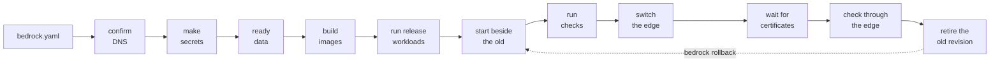
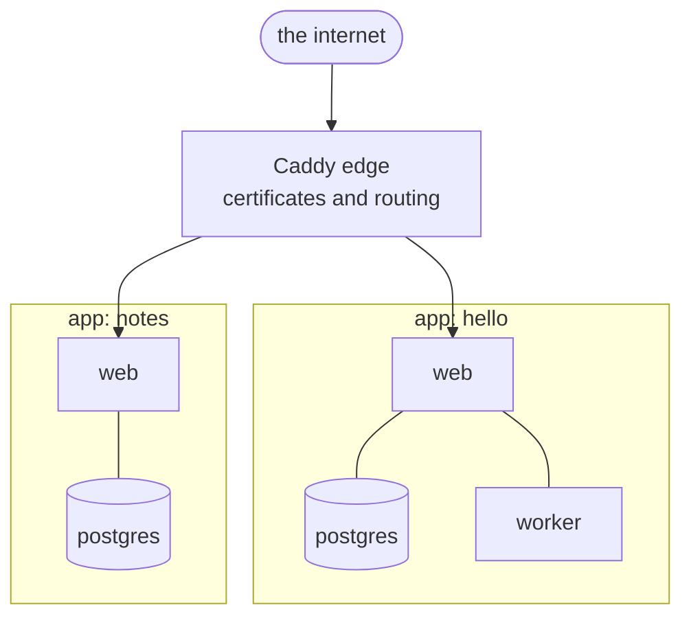

<div align="center">


# Bedrock

**One small program that runs your machines.**

Builds, certificates, secrets, backups, health checks and alerts.<br>
Everything a server needs for the apps it hosts, from a single static binary.

<a href="https://github.com/kylebegeman/bedrock/releases/latest"></a>
<a href="https://github.com/kylebegeman/bedrock/actions/workflows/ci.yml?query=branch%3Anext"></a>

<a href="./LICENSE"></a>

[Quick start](#quick-start) · [Manifest](#an-apps-manifest) · [Isolation](#how-apps-are-kept-apart) · [Deploys](#deploying-without-a-pipeline) · [Backups](#backups-that-restore) · [Commands](#commands) · [Docs](#status-and-docs)

</div>

<br>

## Why Bedrock

- **One binary, nothing to install underneath.** A static Go binary installs and operates the whole machine. There is no agent to babysit, no runtime to keep current, and no control plane to pay for.
- **The manifest is the entire interface.** An app describes itself in `bedrock.yaml`. Everything else follows from that file: DNS records, certificates, secrets, data services, health, backups and alerts.
- **Isolation you get by default, not by remembering.** Read-only root, no Linux capabilities, no privilege escalation, a non-root user, and a private network per app. The manifest holds the explicit ways out, and `bedrock exposure` shows what each container really got.
- **Backups that are proven rather than hoped for.** Every backup is quiesced and consistent, and `bedrock drill` restores it beside the app, starts the app on it and verifies it on a schedule.
- **No pipeline required.** `git push bedrock main` deploys and streams every step back. A push whose deploy fails is refused, so the branch on the machine is always what runs.

## How a deploy works



The old revision is kept, not deleted, so `bedrock rollback` brings it back. Every container is told its `BEDROCK_APP`, `BEDROCK_WORKLOAD` and `BEDROCK_REVISION`.

## Quick start

```sh
bedrock host setup                 # prepare a fresh Ubuntu or Debian machine
bedrock integration set cloudflare # DNS records for your hosts
bedrock integration set storage    # Backblaze B2 or any S3 store, for backups
bedrock integration set email      # SMTP, for alerts

mkdir my-app && cd my-app
bedrock init my-app --host app.example.com  # write a starting bedrock.yaml
bedrock deploy .                   # build, check, switch the edge
bedrock status                     # health, traffic, errors, backups

bedrock launch https://github.com/you/site --host site.example.com  # or from a repository
```

Bedrock needs Ubuntu 22.04 or 24.04, or Debian 12 or 13, on x86_64 or aarch64.

## An app's manifest

An app describes itself in `bedrock.yaml` at the root of its source.
`bedrock init` writes a commented one for the shape you are building, so a
new app never starts from a blank file:

```sh
bedrock init blog --kind static --host blog.example.com
bedrock init api --host api.example.com --postgres
bedrock init mailer --kind worker
bedrock init nightly --kind cron --schedule "0 4 * * *"
```

It only writes a file; nothing on a machine is touched. What it writes is
parsed and validated before it reaches disk, so a generated manifest always
loads. Here is one in full:

```yaml
app: hello
description: What this is for
owner: personal
workloads:
  web:
    kind: web              # web, static, worker, cron or release
    build: {context: .}    # or image: ghcr.io/you/hello:1.2
    port: 8000
    routes:
      - host: hello.example.com
        dns: direct        # bedrock keeps the Cloudflare record (or proxied)
      - host: example.com
        path: /hello       # a prefix; longest wins on a host
    env: {GREETING: hello}
    secrets: [API_KEY]     # names only; values live in bedrock's store
    health: {path: /healthz}
    resources: {memory: 256m, cpus: 0.5}   # memory defaults to 2g
    tmpfs: [/app/.cache]   # writable in memory; the root filesystem is read-only
    # user: "1000:1000"    # default: the image's user, or nobody for a root image
    # capabilities: [NET_BIND_SERVICE]     # default: none at all
    # writable_root: true  # the explicit way out of a read-only root
    # privileged: true     # for the rare workload that runs containers
  site:
    kind: static
    dir: public            # served by a file server
    routes: [{host: www.example.com}]
  nightly:
    kind: cron
    image: alpine:3.21
    schedule: "0 2 * * *"  # five fields, UTC
    command: [sh, -c, "echo tidy"]
    mounts: [{volume: files, path: /files}]
data:
  postgres: {version: "16"}  # DATABASE_URL reaches every workload
  volumes:
    files: {description: What people upload}
backup:                      # optional; an app with data is backed up
  schedule: "0 3 * * *"      #   nightly at 03:00 UTC (the default)
  drill: "0 4 * * 0"         #   restored and verified on Sundays (the default)
  keep: {daily: 7, weekly: 4, monthly: 6}
  verify: {sql: select count(*) from posts, at_least: 1}
checks:
  - url: https://hello.example.com/
    contains: hello
```

<details>
<summary><b>A larger app, with releases, singletons and derived secrets</b></summary>

<br>

An app with several parts, such as Loom's Core, uses a few more fields:

```yaml
app: core
workloads:
  api:
    kind: web
    build: {target: server}      # workloads built alike share one image
    port: 4773
    routes:
      - host: core.example.com
        path: /api
      - host: runners.example.com
        port: 4774               # a route may reach another port
    aliases: [control]           # more names on the app's network; "api" is one
    singleton: true              # never two at once: the old one stops first
    grace: 60s                   # time to stop before it is killed (10s)
    secrets: [API_DATABASE_URL]
  worker:
    kind: worker
    build: {target: server}
    health:
      command: [node, bin/ready.js]   # run inside; exit 0 means ready
      timeout: 5m
    resources: {pids: 2048}
  migrate:
    kind: release                # runs once per deploy, before anything starts
    order: 1                     # lower first, then by name
    build: {target: server}
    command: [node, bin/migrate.js]
    secrets: [MIGRATION_DATABASE_URL]
    timeout: 10m
data:
  postgres:
    version: "17"
    image: pgvector/pgvector:0.8.0-pg17   # default postgres:<version>-alpine
    user: core_admin             # the superuser; default the app's name
    database: core
    init: deploy/postgres        # first-run scripts, from the source
    secrets: [API_PASSWORD]      # given to the first-run scripts
    database_url: false          # no automatic DATABASE_URL
  objects: {}                    # a MinIO of the app's own at {objects}:9000
secrets:
  generate:                      # made once, when missing
    API_PASSWORD: hex:32         # hex, base64 or base64url of N bytes; value:TEXT
  derive:                        # made again whenever a source changes
    API_DATABASE_URL: "postgres://core_api:{API_PASSWORD}@{postgres}:5432/core"
    MIGRATION_DATABASE_URL: "postgres://core_admin:{BEDROCK_POSTGRES_PASSWORD}@{postgres}:5432/core"
```

Generated and derived values stay on the machine; only their names appear
anywhere. `{postgres}` and `{objects}` are the data services' names on the
app's network, the object store's root user is `MINIO_ROOT_USER` and
`MINIO_ROOT_PASSWORD`, and `{sha256:NAME}` is the hex SHA-256 of a secret.
A release that fails stops the deploy before anything new starts. A
singleton that fails to come up is replaced by its predecessor again. A
backup holds the database, every volume, the object store's files and the
first-run scripts, so a restore on a new machine rebuilds the same roles
before it loads the dump. `bedrock run --secret NAME` gives a one-off command
one more secret, and `bedrock run --stdin` hands it this terminal's input
without recording it anywhere.

One source can hold several apps, such as a product and a worker that runs
other people's code apart from its data: `bedrock deploy <dir> --manifest
bedrock.worker.yaml` deploys the other one, and `bedrock secret copy <app> NAME
<other-app>` gives it a secret the first made, without showing it.

</details>

<details>
<summary><b>A port on the machine itself, past the edge</b></summary>

<br>

Traffic that isn't HTTP on a hostname, such as Headscale's STUN, is published
on the machine's own address instead of routed through the edge:

```yaml
app: headscale
workloads:
  server:
    kind: web
    image: headscale/headscale:0.26
    port: 8080
    routes: [{host: hs.example.com}]
    singleton: true              # required: two copies can't hold one port
    ports:
      - port: 3478               # the container's port
        protocol: udp            # tcp (the default) or udp
        # host_port: 3478        # the machine's port; default the same
        # address: 203.0.113.4   # one of the machine's addresses; default all
```

Only web and worker workloads publish ports, and only as singletons: a deploy
starts the new container beside the old one, and the two can't hold one port,
so a singleton's old container stops first. 22, 80, 443 and 5000 are the
machine's own. A port another app on the machine already publishes is refused
while the deploy is still a plan, and the plan lists what it will publish.
One-off jobs, drills and previews publish nothing.

Docker opens a published port ahead of ufw's rules, so the firewall neither
opens nor closes it: anyone can reach it. Deploys don't change the firewall,
so add the rule yourself, once, on the machine:

```sh
ufw allow 3478/udp
```

That rule changes nothing about what is reachable; it makes `ufw status` say
what is open. `bedrock doctor` lists every port an app publishes on a public
address, and warns about one ufw has no rule for, or allows only from some
sources, since Docker publishes it to everyone either way. To keep a port off
the internet, give it a private `address`; ufw can't narrow it.

`bedrock host setup --web-from cloudflare` does not cover published ports.
Its guard holds 80 and 443 alone, so a published port still answers anyone
who knows the machine's address, and the doctor says so beside each one.

</details>

## How apps are kept apart

Each app runs as if it were alone on the machine.



Its workloads share a network with each other and its database; the ones that
serve traffic also share a network with the edge, and with nothing else. No app
can reach another app's containers or database, or the edge's admin API, which
is a socket only the machine reaches.

| Default | What a workload gets |
|---|---|
| **User** | the image's user, or `nobody` when the image would run as root |
| **Capabilities** | none at all |
| **Privilege escalation** | refused |
| **Root filesystem** | read-only, with `/tmp` in memory |
| **Memory** | 2 GiB |
| **Processes** | 4096 |

The manifest fields above are the explicit ways out, and `bedrock exposure`
shows each container as Docker runs it: its user, privileges, root filesystem,
networks, published ports and mounts, and anything that shares a network it
shouldn't.

## Deploying without a pipeline

A route with `dns: direct` or `dns: proxied` gets its Cloudflare record from
the deploy, which refuses a record that points at another machine; `bedrock
dns point <host>` moves one on purpose. Retiring a route, or the app, removes
its record. `bedrock dns` explains every host; `bedrock dns audit` finds
records that point here with nothing routed.

An app is told who its visitor is in `X-Forwarded-For` and `X-Real-IP`: one
address each, whatever the request claimed. Behind Cloudflare's proxy that
is the visitor Cloudflare names, believed only on connections from
Cloudflare's own ranges, which `bedrock host setup` keeps on every machine.

A proxied record hides the machine's address, but only until someone learns
it. `bedrock host setup --web-from cloudflare` makes that not matter: only
Cloudflare's proxy may reach 80 and 443, so the address answers nobody else
on the web. Setup reads Cloudflare's published ranges and allows them in ufw
before it removes the open rules. Docker forwards the edge's published ports
past ufw, so setup also puts a guard in Docker's `DOCKER-USER` chain, run
again at every boot before Docker starts. It keeps a copy of the ranges in
`/etc/bedrock` for when the list can't be read, and `bedrock host
reconcile` keeps it current. Every route must
then be `dns: proxied`: setup refuses while an app routes a host any other
way, and `deploy`, `rollback` and `dns point` refuse to add one. SSH stays
reachable, keys only. Running setup again keeps the setting unless
`--web-from` is given, and `--web-from anyone` opens the web again. The guard
covers 80 and 443 only: a port an app publishes on the machine with `ports:`
stays open to anyone, and `bedrock doctor` says so.

`bedrock git allow <app> <public key>` lets a key push that app and nothing
else. Then, from the app's checkout:

```sh
git remote add bedrock bedrock@<machine>:<app>.git
git push bedrock main        # deploys, and streams every step back
```

A push whose deploy fails is refused, so the branch on the machine is what
runs. `bedrock deploy . --to bedrock@<machine>` sends a working tree the same
way, commit or not. `bedrock git webhook <app> --repo git@github.com:you/app.git`
deploys when GitHub says the branch moved, with a deploy key and secret
bedrock makes and shows once.

`bedrock launch <repository> --host <hostname>` takes a repository from
nothing to running: it fetches the branch, works out what the source is (a
Dockerfile, or a built site), writes the manifest it is missing and deploys
it. What it guesses is deliberately narrow; anything else is refused with a
suggestion.

`bedrock preview up <repository> --branch <branch> --domain preview.example.com`
runs a branch as its own app beside the one it is a branch of: a derived
name, its own containers and an empty database, at hostnames under the
preview domain, with every route behind a sign-in (`auth: loom`, below).
Pushing the same branch again updates it; `bedrock preview ls` lists them,
and `bedrock remove <preview> --data` throws one away, the secrets it was
given included.

`bedrock move out <app> --yes > handoff.json` on one machine and
`bedrock move in <app> --handoff handoff.json` on another move an app's data
through the backup bucket both machines read, and `bedrock move secrets`
seals its secrets for the target. The source keeps serving until DNS is
pointed at the target and the source is removed.

`bedrock remove <app>` takes an app off the machine and keeps its volumes,
database and sealed secrets, so it can come back with what it had. `--data`
removes those too, and `--secrets` forgets only the secrets. An app removed
without its data can be cleared later: `bedrock remove <app> --data` for an
app that is no longer on the machine finds what it left behind (its sealed
secrets, volumes, database and networks), names each one in the plan and
removes them. Its backups in the storage bucket are never touched, and are
the only way back.

## A sign-in in front of a route

A route marked `auth: loom` is put behind a Loom Core's sign-in by the edge:
the app behind it never sees a request from someone who is not signed in,
and needs no auth code of its own. `bedrock integration set loom` names the
Core's verify endpoint. A machine without that integration refuses to
deploy a guarded route rather than serve it open, and previews rely on it.

## What Bedrock keeps an eye on

The daemon watches every app and the machine once a minute: containers
running, health paths and checks answering through the edge, certificates
valid and renewing, disk and memory, backups fresh and drills passing, and
any URL added with `bedrock watch add` (the other machine's sites, say). A
problem has to hold for three rounds before it becomes an alert, one alert
per app, and you hear once when it starts, once a day while it lasts, and
once when it recovers.

| Command | Shows |
|---|---|
| `bedrock alerts` | what is wrong now, and what was |
| `bedrock status` | health beside each app's requests, errors, p95, CPU, memory and disk |
| `bedrock ls` | the registry: owner, hosts, repository, last deploy, last backup |
| `bedrock exposure` | what each container may do and what reaches it |
| `bedrock doctor` | what to fix on this machine; changes nothing |

## Backups that restore

Backups go to one bucket per app with restic, encrypted with a password made
once per storage account.

App backups drain Bedrock-managed jobs, stop running workloads gracefully,
stop the object store, dump PostgreSQL, and snapshot the unchanged volume
files. **This is a maintenance window**: the app is unavailable for the capture
and upload, bounded to 30 minutes. Backups then restart exactly the containers
that were running, with the object store first. Retention runs after service is
restored. A forced shutdown aborts the capture instead of certifying an
inconsistent snapshot.

| Command | What it does |
|---|---|
| `bedrock backup <app>` | run one now |
| `bedrock backup bedrock` | snapshot the machine's own state and sealed secrets |
| `bedrock drill <app>` | restore the latest snapshot beside the app, start it, verify, clean up |
| `bedrock restore <app>` | bring data onto a machine that doesn't run the app yet |
| `bedrock backups` | list what happened |

`bedrock drill` uses an internal network with no outbound access, starts all
long-running workloads before probing readiness, and never runs release or cron
jobs. Privileged workloads cannot be safely drilled, and workloads that require
external services may fail their drill readiness check.

Restore the app's original secrets from the sealed machine backup before
restoring data on a new machine. Bedrock refuses to generate replacement keys
for restored data, which could make encrypted records unreadable.

> [!IMPORTANT]
> The pause journal survives daemon restarts: the daemon restores paused
> containers before accepting work, and a failed restart retains the journal and
> reports the error. Cron, `bedrock run --stdin`, `bedrock exec` and
> `bedrock psql` share the backup lock. Direct Docker or SQL writes and external
> database writers are outside this contract: do not run them during a backup.
> All app writers must be Bedrock-managed. Pick `backup.schedule` for an
> acceptable maintenance window, and note that an app must not use its own
> paused object store as its backup destination. Offsite storage remains the
> recovery target.

## Secrets

The credentials Bedrock itself uses are integrations, kept sealed like any
secret: `bedrock integration set storage` (Backblaze B2 or any S3 store),
`bedrock integration set email` (SMTP, for alerts),
`bedrock integration set cloudflare` (checked against the API before it is
kept) and `bedrock integration set loom` (a Loom Core's verify endpoint, for
routes behind a sign-in). Setting one again changes only what is answered; a
blank answer keeps the current value. `bedrock integration list` shows which
are set and when each was last used, never the values.

<details>
<summary><b>Moving a secret between machines</b></summary>

<br>

`bedrock secret recipient` initializes the machine identity if needed and prints
only its public age recipient. Keep `/etc/bedrock/secrets.key` in your recovery
process; automation never prints its private recovery key.

`bedrock secret export core TOKEN runner --recipient age1...` emits only
ciphertext. Pipe that to `bedrock secret import runner TOKEN` on the receiving
machine through pinned SSH connections. Transfers expire after ten minutes, are
bound to the receiving app and name, and are idempotent. Integration credentials
cannot be exported. `bedrock move secrets <app> --to <age1...>` does the same
for every secret an app holds at once, which is what a move needs.

</details>

## Commands

| | |
|---|---|
| **Machine** | `host` · `daemon` · `doctor` · `upgrade` · `version` · `status` · `alerts` · `watch` |
| **Apps** | `init` · `launch` · `deploy` · `preview` · `rollback` · `remove` · `move` · `ls` · `ps` · `logs` · `history` · `gc` |
| **Data** | `backup` · `backups` · `restore` · `drill` · `psql` |
| **Access** | `secret` · `integration` · `git` · `exec` · `run` · `jobs` |
| **Network** | `dns` · `exposure` |

Run `bedrock <command> --help` for any of them.

Every operation on the machine, from a deploy or a backup to a host setup
or an upgrade, takes `--plan` to see it first and `--digest` to apply only
what was seen; the settings commands (`secret set`, `integration set`,
`git allow`, `watch add`) apply at once. Between reading a plan and applying
it the manifest or the machine can move, so the digest is how an agent, or a
person, applies the plan they actually approved:

```sh
bedrock deploy ./app --plan --json | jq -r .digest
bedrock deploy ./app --digest <hex>
```

A plan that has changed runs nothing and records nothing. `--digest` implies
`--yes`, because naming the plan is the approval.

## Build

```sh
make check   # gofmt, vet, test
make build   # bin/bedrock for this Mac
make linux   # bin/bedrock-linux-amd64 for the machines
```

One static binary, no runtime to install.

<details>
<summary><b>Cutting a release</b></summary>

<br>

Run tests and the lane proof, commit, then run
`scripts/build-release.sh 0.7.0 /tmp/bedrock-release-0.7.0` from a clean
checkout. It builds static Linux and macOS binaries for amd64 and arm64 plus
`SHA256SUMS`, stamped with the version and exact source commit. Publish those
exact files on the matching GitHub release.

Consumers pin the version and SHA-256 in reviewed source, verify before
execution, and never pipe a downloaded script into a shell. An artifact
replacement needs a new reviewed pin; do not overwrite published assets.

</details>

## Status and docs

0.7 is the first Go release. Bedrock is the Go rewrite of Ophelia; the Python
0.6 line is archived on the `ophelia-0.6` branch and the `ophelia-0.6-final`
tag, and stays there.

Bedrock stays on 0.7.x. There is no 0.8 or 0.9: a finished feature is a patch
release, cut when that feature is done rather than when a group of them is.

A machine already running bedrock upgrades itself, checking the download
against the checksums published beside it:

```sh
bedrock upgrade --version 0.7.5
```

`scripts/install-release.sh 0.7.5 <host>...` is the bootstrap, for a machine
that has no bedrock on it yet.

| Document | What it covers |
|---|---|
| [docs/direction.html](docs/direction.html) | what Bedrock is for, where it stands, and what is next |
| [docs/ideas.html](docs/ideas.html) | the 37 ideas, and which are tabled |
| [docs/plan.html](docs/plan.html) | the 0.7 plan, delivered and closed |
| [docs/blueprint.html](docs/blueprint.html) | why the rewrite happened, written under an older name |
| [lane/README.md](lane/README.md) | the proving ground |

Every feature is proven on a real machine that is wiped and rebuilt for the
purpose.

## License

Apache 2.0. See [LICENSE](LICENSE) and [NOTICE](NOTICE).
